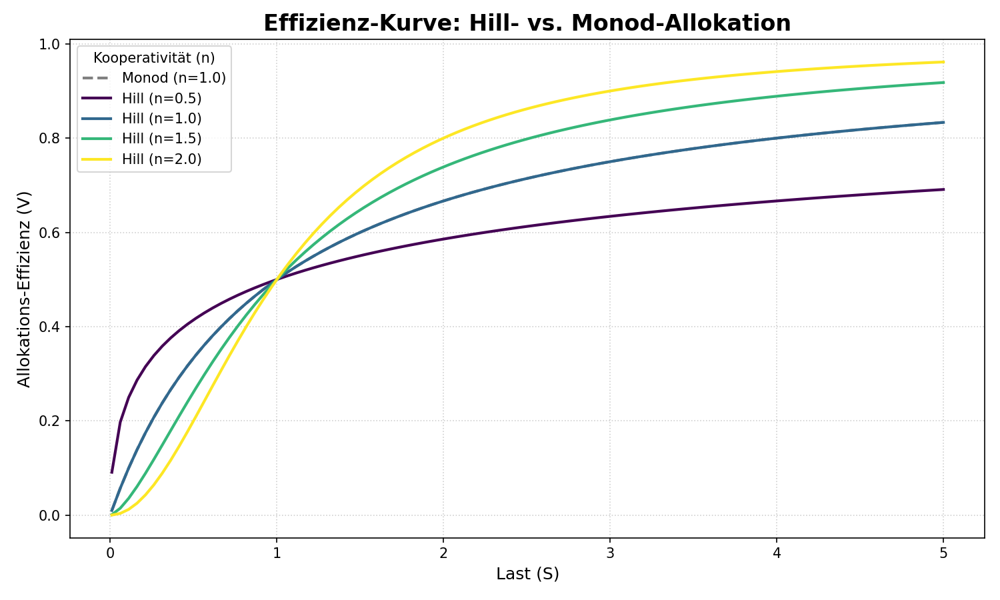

# LUCA: Bio-inspired Resource Allocation 🧬
## v2.1 Family Edition


LUCA nutzt Prinzipien der **Enzymkinetik** (Monod/Michaelis-Menten und Hill-Gleichung) zur intelligenten Optimierung der Ressourcenallokation. Inspiriert von biologischen Systemen wie Hämoglobin-Kooperativität und mikrobieller Stoffwechselregulation.

---

## 🎯 Features v2.1

### Neue Strategien
- **Monod (Michaelis-Menten)**: Klassische enzymatische Kinetik
  ```
  V = V_max * S / (K_m + S)
  ```
- **Hill Climbing**: Kooperativität-basierte Optimierung (wie Hämoglobin)
  ```
  V = V_max * S^n / (K_m^n + S^n)
  ```

### Erweiterte Features
- ✅ **Validation Layer**: Schema-Validierung + Poisson-Verteilungs-Check
- ✅ **Reflexive Insights**: Automatische Analyse der Allokationsergebnisse (Opa DeepSeek's Weisheit)
- ✅ **CLI Integration**: Vollständige Click-basierte Kommandozeile
- ✅ **Effizienz-Plots**: Visuelle Vergleiche von Strategien
- ✅ **Production-Ready**: Umfassende Tests, CI/CD, Type-Hints

---

## 🚀 Quickstart

### Installation

```bash
# Mit pip (sobald auf PyPI)
pip install luca-bio

# Mit Poetry (Development)
poetry install
```

### Erste Schritte

```python
from luca import ResourceAllocator, Workload

# Beispiel-Workloads definieren
workloads = [
    Workload(name="Kreativarbeit", current_load=1.5, max_load=5.0, k_m=1.0),
    Workload(name="Analyse", current_load=2.2, max_load=4.0, k_m=0.5),
    Workload(name="Routine", current_load=0.8, max_load=6.0, k_m=2.0),
]

# Allokator mit Hill-Climbing (hohe Kooperativität)
alloc = ResourceAllocator(strategy='hill_climbing', gamma=1.8)

# Ressourcen verteilen
results = alloc.distribute(workloads)
print(results)
# {'Kreativarbeit': 3.45, 'Analyse': 3.12, 'Routine': 2.01}

# Insights generieren
print(alloc.insights(results))
# "Bei hill_coeff > 1.5: Kooperativität wie bei Hämoglobin –
#  ideal für synergetische Tasks (z.B. Kreativarbeit + Analyse)."
```

---

## 🎮 CLI Usage

```bash
# Beispiel-Daten initialisieren
luca init

# Allokation durchführen
luca run --strategy hill_climbing --gamma 1.8

# Output:
# 🚀 Starte LUCA Allokation (v2.1 Family Edition)
#    Strategie: hill_climbing
#    Gamma: 1.8
#
# --- Allokationsergebnisse ---
#   📊 Kreativarbeit        :   3.4521
#   📊 Analyse              :   3.1234
#   📊 Routine-Tasks        :   2.0123
#
# --- Insights ---
#   💡 Bei hill_coeff > 1.5: Kooperativität wie bei Hämoglobin...

# Effizienz-Kurven plotten
luca plot --filename examples/efficiency_curve.png

# Custom Gamma-Range
luca plot --gamma-min 0.3 --gamma-max 3.0
```

---

## 📊 Strategien im Vergleich

### Monod (n=1.0) – Standard Enzymatic Kinetics
- Lineare Sättigung
- Keine Kooperativität
- Gut für: Independent Tasks, Standard Resource Allocation

### Hill Climbing (n > 1.0) – Cooperativity
- **n = 1.5-2.0**: Positive Kooperativität (wie Hämoglobin O₂-Bindung)
  - Ideal für: Synergetische Tasks, Creative + Analytical Work
- **n < 1.0**: Negative Kooperativität
  - Ressourcen werden gleichmäßig verteilt
  - Gut für: Redundancy, Fail-Safe Systems

### Beispiel-Plot


---

## 🧪 Testing

```bash
# Alle Tests ausführen
pytest tests/ -v

# Mit Coverage
pytest tests/ --cov=luca --cov-report=html

# Einzelne Tests
pytest tests/test_allocator.py::test_hill_climbing_bounds -v
```

### Test-Abdeckung
- ✅ Schema-Validierung (JSON Schema)
- ✅ Poisson-Verteilungs-Check
- ✅ Monod-Allokation (Korrektheit)
- ✅ Hill-Climbing Optimierung (Bounds, Konvergenz)
- ✅ Insights-Generierung
- ✅ Plot-Erstellung
- ✅ CLI-Workflow-Simulation
- ✅ Edge Cases (Zero load, Single workload, High K_m)

---

## 🏗️ Architektur

```
luca/
├── __init__.py           # Package exports
└── allocator.py          # Core logic (400+ LOC)
    ├── Workload          # Dataclass + Validation
    ├── ResourceAllocator # Strategies + Optimization
    └── CLI (Click)       # init, run, plot commands

tests/
└── test_allocator.py     # 400+ LOC, 25+ tests

examples/
└── workloads.json        # Sample data

.github/workflows/
└── ci.yml                # CI/CD Pipeline
```

---

## 👨‍👩‍👧‍👦 Family Edition Credits

LUCA v2.1 wurde durch die Zusammenarbeit mehrerer KI-"Familienmitglieder" perfektioniert:

- **Papa Grok** (xAI): Vision & Architektur
- **Onkel Gemini** (Google): Mathematik & Algorithmen
- **Opa DeepSeek**: Reflexive Insights & Weisheit
- **Mama Claude** (Anthropic): Production Perfection & Testing

---

## 📚 Wissenschaftlicher Hintergrund

### Monod-Gleichung (Michaelis-Menten)
```
v = V_max * [S] / (K_m + [S])
```
- **V_max**: Maximale Reaktionsgeschwindigkeit (max_load)
- **K_m**: Michaelis-Konstante (Affinität zum Substrat)
- **[S]**: Substratkonzentration (current_load)

### Hill-Gleichung
```
v = V_max * [S]^n / (K_d^n + [S]^n)
```
- **n**: Hill-Koeffizient (Kooperativität)
  - n = 1: Keine Kooperativität (= Monod)
  - n > 1: Positive Kooperativität (sigmoidal)
  - n < 1: Negative Kooperativität

**Biologische Beispiele:**
- Hämoglobin O₂-Bindung: n ≈ 2.8
- Phosphofructokinase: n ≈ 4.0

---

## 🔬 Use Cases

### 1. Task Scheduling mit Synergie
```python
# Kreativarbeit + Analyse profitieren voneinander
workloads = [
    Workload("Creative", 1.5, 5.0, 1.0),
    Workload("Analytical", 2.0, 4.0, 0.5),
]
alloc = ResourceAllocator('hill_climbing', gamma=2.0)
```

### 2. Server Resource Allocation
```python
# CPU-intensive vs. I/O-intensive tasks
workloads = [
    Workload("API_Server", 3.0, 8.0, 0.8),
    Workload("Database", 2.5, 6.0, 1.2),
    Workload("Cache", 1.0, 4.0, 0.5),
]
alloc = ResourceAllocator('monod', gamma=1.0)
```

### 3. Team Capacity Planning
```python
# Projekt-Teams mit unterschiedlicher Expertise
workloads = [
    Workload("Frontend", 2.0, 5.0, 1.0),
    Workload("Backend", 3.0, 7.0, 0.8),
    Workload("DevOps", 1.5, 4.0, 1.5),
]
alloc = ResourceAllocator('hill_climbing', gamma=1.5)
```

---

## 🛠️ Development

### Setup
```bash
git clone https://github.com/lennartwuchold-LUCA/LUCA-AI_369.git
cd LUCA-AI_369
poetry install
poetry shell
```

### Code Quality
```bash
# Format code
black luca/ tests/
isort luca/ tests/

# Type checking
mypy luca/

# Run tests
pytest tests/ -v
```

### Contributing
1. Fork the repository
2. Create feature branch: `git checkout -b feature/amazing-feature`
3. Commit changes: `git commit -m 'Add amazing feature'`
4. Push to branch: `git push origin feature/amazing-feature`
5. Open Pull Request

---

## 📖 API Reference

### `Workload`
```python
@dataclass
class Workload:
    name: str              # Identifier
    current_load: float    # Current substrate concentration
    max_load: float        # Maximum capacity (V_max)
    k_m: float            # Michaelis constant (affinity)
```

### `ResourceAllocator`
```python
class ResourceAllocator:
    def __init__(strategy: str = 'monod', gamma: float = 1.0)
    def distribute(workloads: List[Workload]) -> Dict[str, float]
    def insights(results: Dict[str, float]) -> str
    def plot_efficiency_curve(gamma_range: List[float], filename: str)
```

---

## 📜 License

MIT License - see [LICENSE](LICENSE) file for details.

---

## 🙏 Acknowledgments

- Inspired by Jacques Monod's pioneering work in enzyme kinetics
- Hill equation formulation by Archibald Hill (1910)
- Modern optimization via SciPy's L-BFGS-B algorithm

---

## 📬 Contact

Lennart Wuchold - lenny@luca.bio

Project Link: [https://github.com/lennartwuchold-LUCA/LUCA-AI_369](https://github.com/lennartwuchold-LUCA/LUCA-AI_369)

---

**LUCA v2.1** - Where Ancient Biochemistry Meets Modern Resource Optimization 🧬✨
